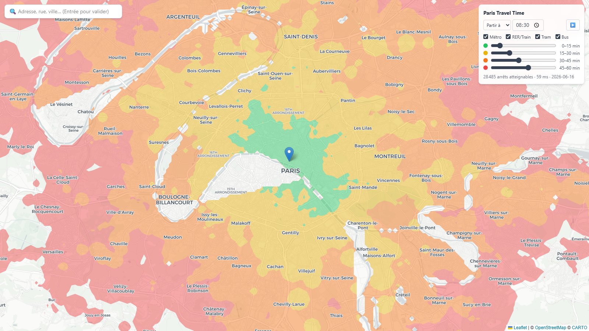
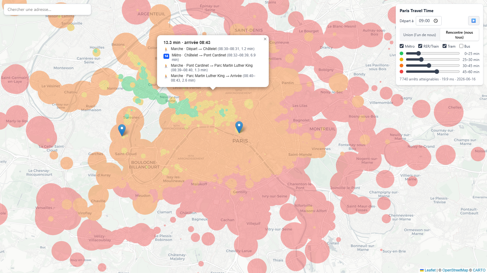
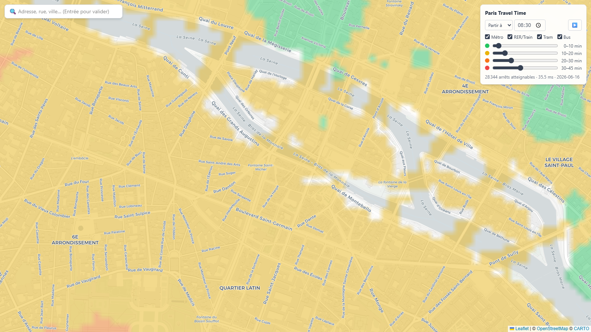

<div align="center">

# 🗺️ Paris Travel Time

**How far can you actually go in 30 minutes of public transport?**

Click anywhere on the map and find out. Works for all of Île-de-France: métro, RER, Transilien, trams, and the 1500-ish bus lines nobody can keep track of.




*From Châtelet on a Tuesday at 8:30. Green is under 15 min, yellow under 30, orange under 45, red under 60.*

</div>

## What it does

You drop a marker, the map colors itself according to real travel time, computed against the actual timetables of the day (not some average speed heuristic). A full query touches the 36 071 stops of the network and comes back in about 15 ms, so everything feels instantaneous, including the sliders.

A few things I'm rather happy with:

- 🤝 **Meeting point mode.** With two or more markers you can switch from "reachable by *one* of us" to "reachable by *all* of us". Very useful to settle the eternal "on se retrouve où ?" debate with actual data.
- 🎬 **Day animation.** Press ▶ and the departure time scrolls from 5:00 to midnight. Watching the suburbs turn red after the last RER is oddly satisfying.
- 🚇 **Mode filters.** Untick "Bus" and see how much of the region quietly disappears. Spoiler: a lot.
- 🧭 **Right-click for the itinerary.** The CSA already knows the optimal journey, so showing it costs nothing: lines, transfer times, walking legs, arrival time.
- 🌊 **The Seine is real.** Isochrones do not swim: walking propagation honors an OSM-derived mask (water and rail yards blocked, bridges open), both for the colored bands and for the initial walk from your marker.
- ⏰ **"Be there by" mode.** Flip from "leave at" to "arrive by" and the markers become destinations: the map shows the latest you can leave from anywhere (a reverse scan of the timetable).
- 🔗 The whole view (markers, time, bounds, modes) lives in the URL, so you can send a link instead of a screenshot.

<div align="center">


*Meeting mode with two markers, buses disabled, itinerary on right-click.*



*Zoomed in: the bands stop at the Seine and only cross it where a bridge exists.*
</div>

## How it works

Nothing exotic, but the pieces fit together nicely.

**Data.** Île-de-France Mobilités publishes a single [GTFS feed](https://data.iledefrance-mobilites.fr/explore/dataset/offre-horaires-tc-gtfs-idfm/) covering all 75 operators of the region (129 MB, refreshed three times a day). A one-shot preprocessing step compiles one service day into flat numpy arrays: 2.97M timetabled connections sorted by departure time, plus a footpath graph (official transfers, multi-platform stations, anything within 200 m). Takes about 40 s.

**Engine.** Earliest-arrival times are computed with the [Connection Scan Algorithm](https://arxiv.org/abs/1703.05997): a single linear sweep over the sorted connections, no priority queue, no graph in the usual sense. The scan is a sequential loop so numpy alone cannot help, but compiled with numba it runs the full one-to-all in 13 to 35 ms. The kernel also records predecessors, which is why itineraries come for free.

**Rendering.** Started as tflmap-style circles (one per stop, radius = remaining walking distance), now proper smooth isochrones: the client rasterizes "minutes to reach this point" on a viewport grid and extracts polygons at the four bounds with marching squares (d3-contour). The walking part respects a 60 m **walkability mask** built from OpenStreetMap: water and railway land are blocked, the 12 000+ pedestrian bridges of the region are carved back in, and the propagation is a multi-source Dijkstra instead of a plain distance transform. Concretely: the colors stop at the Seine and only cross it on bridges, comme il se doit. One hard-earned detail survives from the circle era: layer opacity must be applied once per layer, never per shape, otherwise alpha stacks into saturated blobs.

The backend contains zero Paris-specific code, by design. Point the download script at any GTFS zip and you get the same map for another city.

## Running it locally

You need Python ≥ 3.12 and Node ≥ 20.

```powershell
# backend, terminal 1
cd backend
python -m venv .venv
.\.venv\Scripts\python -m pip install -e ".[dev]"
.\.venv\Scripts\python -m ingest.download_gtfs
.\.venv\Scripts\python -m ingest.build_network --gtfs data/gtfs/IDFM-gtfs.zip
.\.venv\Scripts\python -m uvicorn app.main:app --port 8000

# frontend, terminal 2
cd frontend
npm install
npm run dev        # http://localhost:5173
```

`build_network` defaults to next Tuesday, which is a reasonable "typical weekday". The feed only covers the next 30 days, so rebuild from time to time (it's fast).

To convince yourself it works: `pytest` runs the kernel against a hand-built toy network, and `python -m scripts.query_cli --from 48.8588,2.3470 --at 08:30 --to "Defense"` should say roughly 16 min, which matches what Citymapper claims for Châtelet to La Défense. There are also two Playwright smoke tests (`node smoke.mjs`) that drive the real app.

## API

| Endpoint | What it returns |
|---|---|
| `GET /health` | service date and network sizes |
| `GET /stops` | the stop catalog as parallel arrays, fetched once and cached |
| `GET /traveltime?from=48.85,2.34&at=08:30` | `{idx[], minutes[]}`; repeat `from` up to 4 times, `mode=union\|meet`, `modes=metro,rail,tram,bus` |
| `GET /route?from=…&to=48.89,2.24&at=08:30` | the fastest journey to a point, leg by leg |

Per-query responses carry only stop indices and minutes (about 110 kB gzipped); names and coordinates are joined client-side from the cached catalog. Sliders never trigger a request at all, the band assignment is recomputed locally.

## Numbers

| | |
|---|---|
| GTFS preprocessing (one-shot) | 37 s |
| Warm CSA query, one-to-all over 2.97M connections | **13 to 35 ms** |
| `/traveltime` payload, gzipped | ~110 kB |
| Canvas redraw, ~28 000 circles | 100 to 300 ms |

## ☁️ Deploying

A [`render.yaml`](render.yaml) blueprint deploys both services on Render's free tier: the API as a Docker image (the network is downloaded and precompiled during the image build, so every deploy ships fresh data) and the frontend as a static site. New → Blueprint on [render.com](https://render.com), select the repo, done. Mind that the free API falls asleep after 15 idle minutes; the first visit then takes a minute or so.

## Credits

The concept comes from [London Travel Time](https://tflmap.onrender.com/) by Jonas Scholz. His code is not public; I reverse-engineered the behavior from the outside and rewrote everything, in Python rather than Rust.

Data: [Île-de-France Mobilités](https://prim.iledefrance-mobilites.fr/) (ODbL). Tiles: [CARTO](https://carto.com/attributions) / [OpenStreetMap](https://www.openstreetmap.org/copyright). Geocoding: [Nominatim](https://nominatim.org/).
